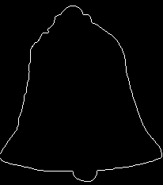
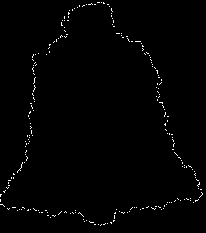

# ICP-for-shape-alignment

### Implementation of Iterative-Closest Point algorithm on 2D point cloud to find matching orientation and scale (Affine transformation) between two images of similar shape. 

Points set 1        | Points set 2 |
:-------------------------:|:-------------------------:|
 |  |

Points set 1 transformed to match points set 2       |
:-------------------------:|
 | 
